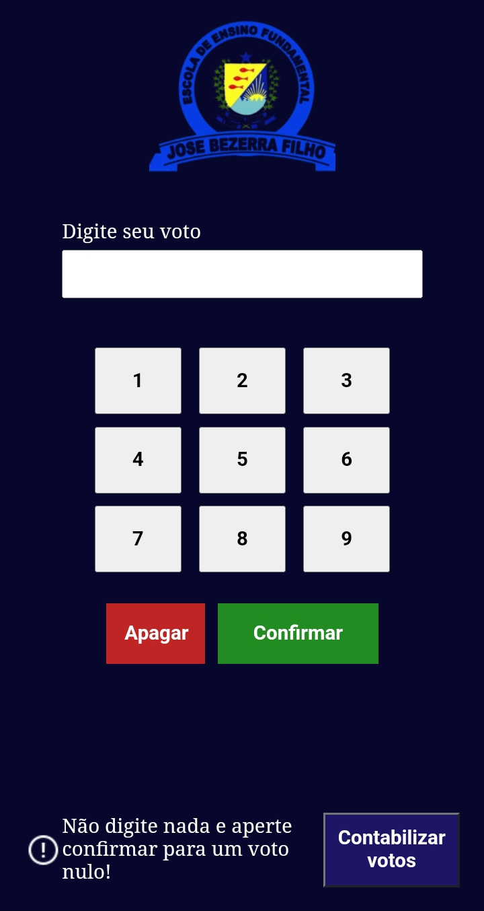
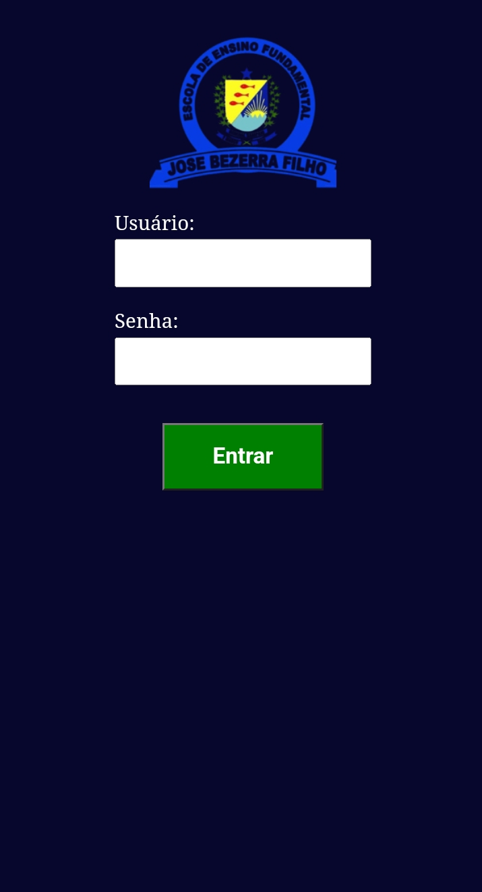
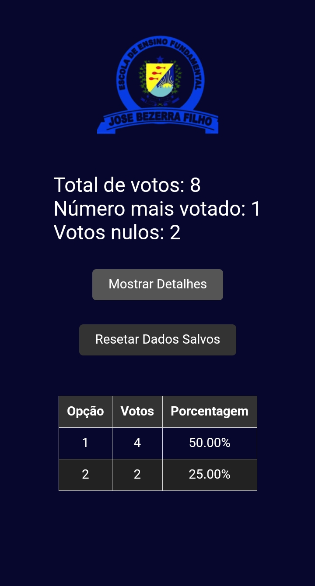

# Sistema de Votação

Este projeto é uma aplicação de sistema de votação desenvolvido como uma aplicação web, permitindo que os usuários votem em diferentes opções disponíveis. Ele foi implementado utilizando HTML, CSS e JavaScript, e está hospedado no GitHub Pages.

## Acesso ao Site

Você pode acessar o sistema de votação através do seguinte link:  
[**Sistema de Votação**](https://lucianoquintela.github.io/sistema-de-votacao/)

## Contexto do Projeto

Durante meu estágio, o supervisor solicitou que eu criasse um sistema de votação para a escolha do Grêmio Estudantil da escola José Besera Filho. Aproveitei a oportunidade de estar participando do evento online **Imersão Dev com Google Gemini** da **Alura** e apliquei meus conhecimentos aprendidos sobre o uso de IA generativa para desenvolver este site.

## Funcionalidades

- **Interface Simples:** Interface amigável e fácil de usar.
- **Votação em Tempo Real:** Os resultados das votações são atualizados em tempo real.
- **Responsivo:** Compatível com dispositivos móveis, tablets e desktops.
- **Armazenamento Local:** Os votos são armazenados no armazenamento local do navegador.

## Tecnologias Utilizadas

- **HTML5**
- **CSS3**
- **JavaScript**
- **Gemini**
- **ChatGPT**

## Imagens do Projeto

Aqui estão algumas imagens do sistema de votação em funcionamento:

|  |  |  |
|:--------------------------------:|:--------------------------------:|:--------------------------------:|
| Tela 01 | Tela 02 | Tela 03 |

> **Nota:** 

## Design no Figma

Você pode acessar o design do projeto no Figma através do seguinte link:  
[**Link para o Figma**](https://www.figma.com/design/3xkhldhJANtuy1tqETK8mB/Untitled?node-id=0-1&t=OiwInqLYqoVqiNr9-0)

## Autor

- **Luciano Quintela** - Desenvolvedor e criador do projeto.
